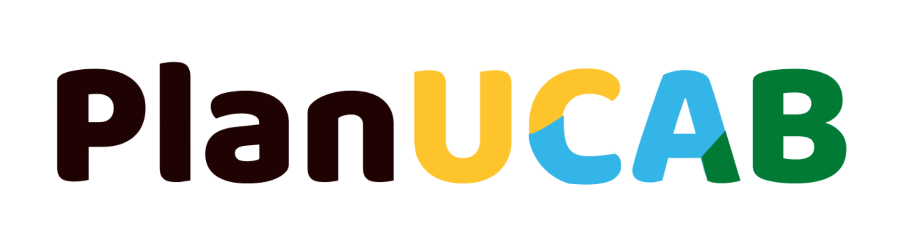

# PlanUCAB

Aplicación web de planificación y gestión de eventos, inspirada en Google Calendar, desarrollada como proyecto académico para la asignatura **Ingeniería de Software** en la Universidad Católica Andrés Bello (UCAB).

###  Tech Stack

**Client:** Angular  
**Server:** Spring MVC

### Integrantes

- [@devonyramirez](https://www.github.com/devonyramirez)
- [@diegoprietoucab](https://www.github.com/diegoprietoucab)

### Documentación
Toda la documentación asociada al proyecto se encuentra a continuación:

- [Brief]()
- [Diagrama de casos de uso]()
- [Especificación de Requisitos de Software (ERS)]()
- [Diagramas de actividades]()
- [Diagramas de clases]()
- [Diagramas de secuencia]()
- [Documento de Arquitectura de Software (DAS)]()
- [Modelo 4C]()
- [Aplicación de tácticas arquitectónicas al proyecto]()